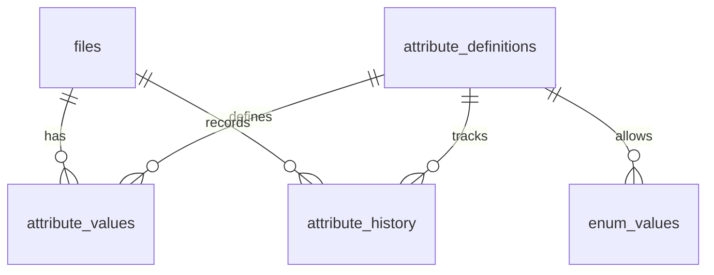

# Facet Database Guide

This document explains the Facet SQLite catalogue in plain language.

## Quick Summary

- Database file location: `.facet/catalogue.db` in your project root.
- Current schema version: `3`.
- Main purpose: track files, attribute definitions, attribute values, and attribute change history.
- Stored procedures: none.
- Triggers: none in the current schema setup.

## ER Diagram

## Version History

| Version | Meaning                                                                           |
| ------- | --------------------------------------------------------------------------------- |
| 0       | Uninitialized database. Facet creates all tables and moves directly to version 3. |
| 1       | Old schema. Facet migrates this to version 2, then to version 3.                  |
| 2       | Intermediate schema. Facet migrates this to version 3.                            |
| 3       | Current schema used by the application.                                           |

Notes:

- Any version not in `0`, `1`, `2`, or `3` is rejected.
- A version `0` database must be empty before initialization.

## Table Reference

### files

Tracks each discovered file and whether it is currently present or missing.

| Field          | Type    | Required | Purpose                                                  |
| -------------- | ------- | -------- | -------------------------------------------------------- |
| id             | INTEGER | Yes      | Row identifier (primary key).                            |
| path           | TEXT    | Yes      | File path relative to the Facet root.                    |
| device         | INTEGER | Yes      | Filesystem device identifier used for identity tracking. |
| inode          | INTEGER | Yes      | Filesystem inode used for identity tracking.             |
| size           | INTEGER | Yes      | File size in bytes.                                      |
| mtime_ns       | INTEGER | Yes      | Last modified time in nanoseconds.                       |
| first_seen     | INTEGER | Yes      | First time the file was observed (nanoseconds).          |
| last_seen      | INTEGER | Yes      | Most recent time the file was observed (nanoseconds).    |
| state          | TEXT    | Yes      | File state (`PRESENT` or `MISSING`).                     |
| hash_algorithm | TEXT    | No       | Hash algorithm name, if hashing is used.                 |
| hash_value     | TEXT    | No       | Hash digest value, if hashing is used.                   |
| hash_time      | INTEGER | No       | Time hash was recorded (nanoseconds).                    |

Rules:

- `(device, inode)` must be unique.
- At most one `PRESENT` row can exist for a given `path`.

### attribute_definitions

Stores the list of available metadata attributes and their validation settings.

| Field       | Type    | Required | Purpose                                            |
| ----------- | ------- | -------- | -------------------------------------------------- |
| id          | INTEGER | Yes      | Row identifier (primary key).                      |
| name        | TEXT    | Yes      | Unique attribute name.                             |
| type        | TEXT    | Yes      | Attribute type (string, integer, enum, and so on). |
| required    | INTEGER | Yes      | Whether the attribute is required (`0` or `1`).    |
| description | TEXT    | No       | Human-friendly description.                        |
| min_value   | REAL    | No       | Minimum value for real-number constraints.         |
| max_value   | REAL    | No       | Maximum value for real-number constraints.         |
| min_integer | INTEGER | No       | Minimum value for integer constraints.             |
| max_integer | INTEGER | No       | Maximum value for integer constraints.             |

Rules:

- `name` must be unique.

### enum_values

Stores allowed choices for enum-type attributes.

| Field        | Type    | Required | Purpose                            |
| ------------ | ------- | -------- | ---------------------------------- |
| id           | INTEGER | Yes      | Row identifier (primary key).      |
| attribute_id | INTEGER | Yes      | Points to an attribute definition. |
| value        | TEXT    | Yes      | One allowed enum value.            |

Rules:

- `(attribute_id, value)` must be unique.
- If an attribute definition is deleted, its enum values are automatically deleted.

### attribute_values

Stores the current attribute values assigned to each file.

| Field         | Type    | Required | Purpose                             |
| ------------- | ------- | -------- | ----------------------------------- |
| file_id       | INTEGER | Yes      | Points to a file row.               |
| attribute_id  | INTEGER | Yes      | Points to an attribute definition.  |
| value_text    | TEXT    | No       | Text/enum value storage.            |
| value_integer | INTEGER | No       | Integer value storage.              |
| value_real    | REAL    | No       | Real-number value storage.          |
| value_boolean | INTEGER | No       | Boolean value storage (`0` or `1`). |

Rules:

- One row per `(file_id, attribute_id)` pair.
- Only the type-appropriate value column is expected to be set.
- Deleting a file or attribute definition automatically deletes related attribute values.

### attribute_history

Stores an audit trail when attribute values change.

| Field        | Type    | Required | Purpose                                     |
| ------------ | ------- | -------- | ------------------------------------------- |
| id           | INTEGER | Yes      | Row identifier (primary key).               |
| file_id      | INTEGER | Yes      | Points to the file whose attribute changed. |
| attribute_id | INTEGER | Yes      | Points to the changed attribute definition. |
| old_value    | TEXT    | No       | Previous value as text.                     |
| new_value    | TEXT    | No       | New value as text.                          |
| changed_at   | INTEGER | Yes      | Time of change (nanoseconds).               |

Rules:

- Deleting a file or attribute definition automatically deletes related history rows.
- Unset operations record `new_value` as null.

## Indexes

Facet creates these indexes to improve read performance and enforce some uniqueness behavior.

| Index                     | Applies To                               | Purpose                                                              |
| ------------------------- | ---------------------------------------- | -------------------------------------------------------------------- |
| idx_files_device_inode    | files(device, inode)                     | Speeds up identity lookups by filesystem identity.                   |
| idx_files_path            | files(path)                              | Speeds up path lookups.                                              |
| idx_files_present_path    | files(path), only where state is PRESENT | Enforces one present row per path and speeds up present-path checks. |
| idx_files_state           | files(state)                             | Speeds up filtering by state.                                        |
| idx_attribute_values_file | attribute_values(file_id)                | Speeds up loading attributes for a file.                             |
| idx_attribute_values_attr | attribute_values(attribute_id)           | Speeds up loading files for an attribute.                            |
| idx_history_file          | attribute_history(file_id)               | Speeds up history lookup for one file.                               |

## Relationships And Delete Behavior

| From                           | To                       | Cardinality | On Delete                           |
| ------------------------------ | ------------------------ | ----------- | ----------------------------------- |
| enum_values.attribute_id       | attribute_definitions.id | Many-to-one | Cascade (enum values removed).      |
| attribute_values.file_id       | files.id                 | Many-to-one | Cascade (attribute values removed). |
| attribute_values.attribute_id  | attribute_definitions.id | Many-to-one | Cascade (attribute values removed). |
| attribute_history.file_id      | files.id                 | Many-to-one | Cascade (history removed).          |
| attribute_history.attribute_id | attribute_definitions.id | Many-to-one | Cascade (history removed).          |

## Common Application Behavior

- File lookups by path prefer currently present rows first.
- File identity lookups use `(device, inode)`.
- File listing is path-ordered.
- Query filtering is currently evaluated in application memory after loading needed data.
- History results are sorted newest first.

## Data Conventions

- Time fields are integer nanoseconds.
- Paths are stored as normalized relative paths under the selected root.
- Paths outside the root are rejected.
- Symlinks are intentionally not tracked.
- File states currently used are `PRESENT` and `MISSING`.

## Runtime Settings

When opening the database, Facet configures SQLite with:

- Write-ahead logging mode (WAL).
- Foreign-key enforcement enabled.
- Normal synchronization mode.
- Busy timeout of 5000 ms.
