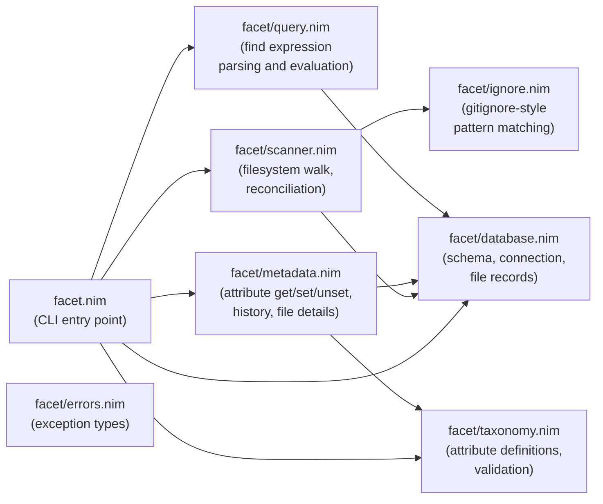
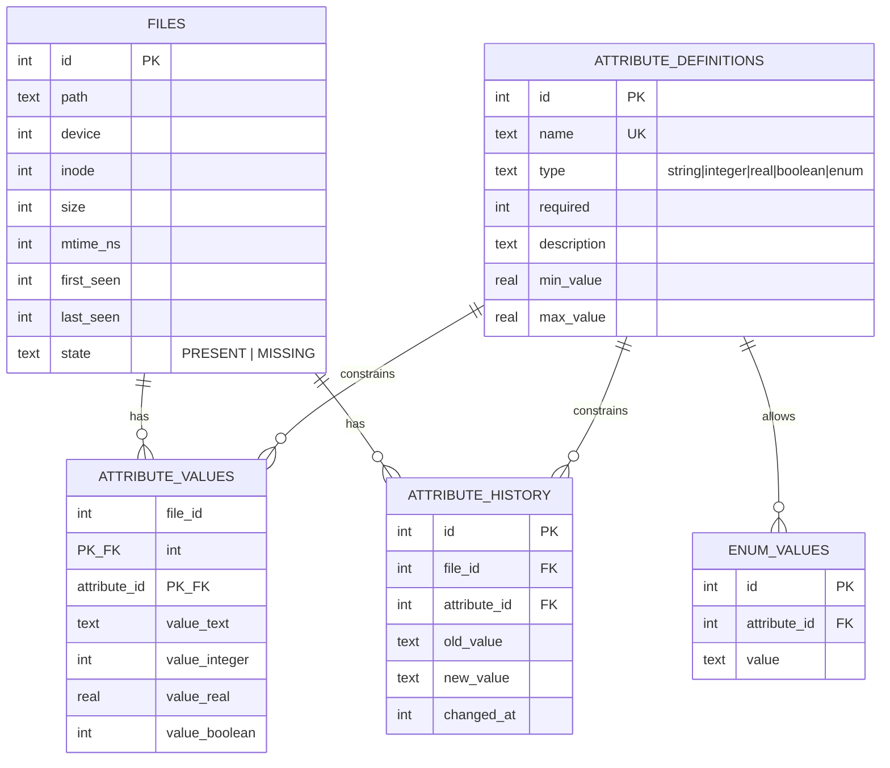
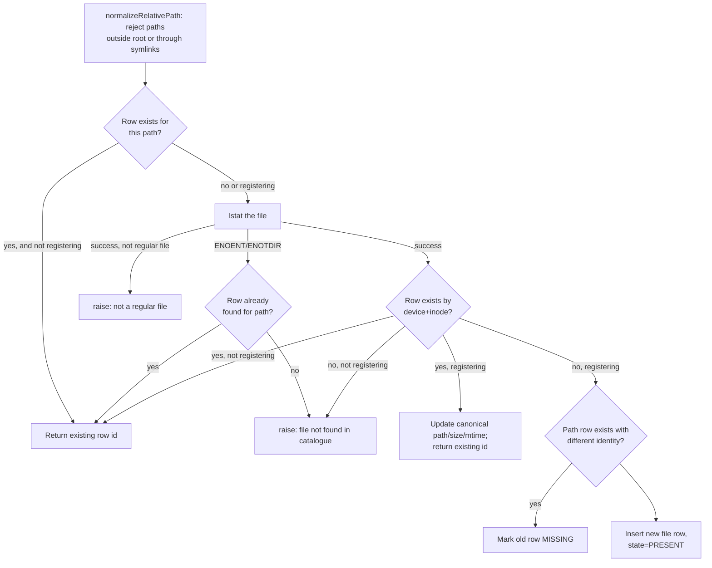
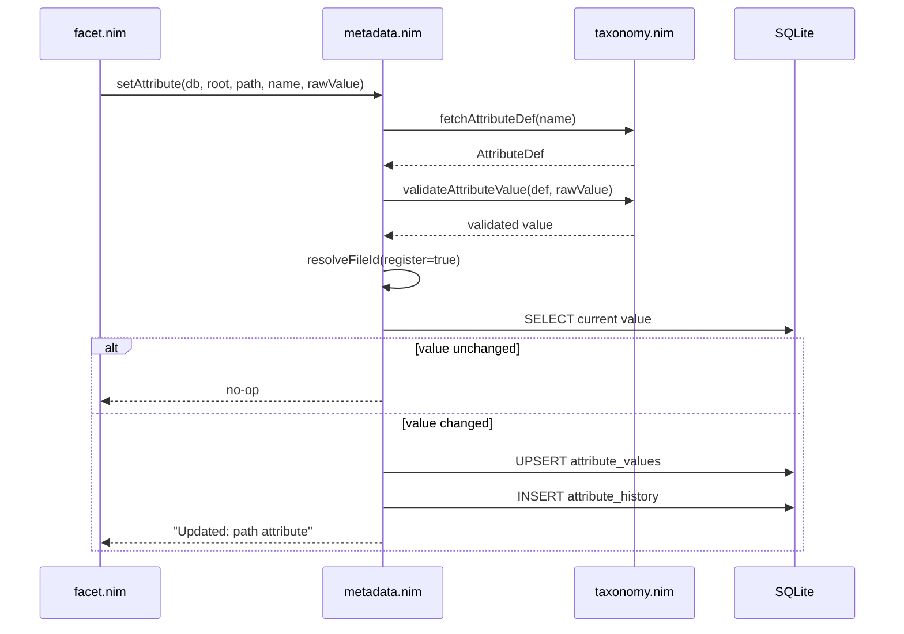

# Facet Design

This document describes the internal architecture of Facet: module
responsibilities, the catalogue schema, and the control flow of its main
operations.

## Goals and Non-Goals

Facet catalogues Linux regular files under a root directory and lets users
attach typed, schema-validated metadata ("attributes") to them, tracking
attribute changes over time. It identifies files by `(device, inode)` so that
renames and moves don't lose associated metadata.

Non-goals: cross-filesystem identity, non-regular files (directories, symlinks,
devices), and distributed/multi-writer catalogues.

## Module Overview

- **`facet.nim`**: parses `commandLineParams()`, dispatches to one handler per
  subcommand, and formats output (including colorized `--help` text). All
  `CatchableError`s raised deeper in the stack are caught here, printed as
  `Error: <msg>`, and turned into exit code 1.
- **`database.nim`**: owns the SQLite connection lifecycle, schema
  creation/migration, and low-level CRUD for the `files` table. Also owns root
  detection (`detectRoot`) and path normalization/containment checks
  (`normalizeRelativePath`).
- **`scanner.nim`**: walks the filesystem under a root, applying ignore rules,
  and reconciles the walk results against the catalogue inside a single
  transaction.
- **`ignore.nim`**: standalone gitignore-style pattern parser and matcher used
  by the scanner. No database dependency.
- **`taxonomy.nim`**: CRUD for attribute _definitions_ (name, type, min/max,
  enum values) and value validation/normalization per type.
- **`metadata.nim`**: attribute _values_ on files — resolving/registering a
  file's identity, setting/unsetting values (with history), and rendering file
  details (text or JSON).
- **`query.nim`**: tokenizes and evaluates `facet find` expressions against
  attribute values.
- **`errors.nim`**: a small exception hierarchy (`FilemetaError` and
  `ValidationError`/`NotFoundError`/`UsageError` subtypes) for future structured
  error handling; current command handlers mostly raise plain `ValueError`.

## Data Model

The catalogue is a single SQLite database at `<root>/.facet/catalogue.db`, using
WAL journaling and `PRAGMA foreign_keys = ON`.

Notes:

- `files` has a `UNIQUE(device, inode)` constraint — one row per physical file —
  and a partial unique index `idx_files_present_path` enforcing at most one
  `PRESENT` row per path at a time. `MISSING` rows for the same path can coexist
  historically.
- `attribute_values` stores one typed column per possible value kind; exactly
  one is populated per row, selected by the corresponding
  `attribute_definitions.type`.
- `attribute_history` retains every change, including unset (`new_value` `NULL`)
  and initial-set (`old_value` `NULL`) events, distinguishing SQL `NULL` from an
  empty string.
- Schema version is tracked via `PRAGMA user_version`. Version 1 predates
  hash-related columns being dropped; `initDatabase` migrates version 1 to
  version 2 by rebuilding the `files` table without `hash_algorithm`,
  `hash_value`, and `hash_time`, preserving indexes/triggers and validating
  foreign keys post-migration.

## File Identity Resolution

`resolveFileId` (in `metadata.nim`) is the shared path used by `get`, `set`,
`unset`, and `history` to map a `PATH` argument to a `files.id`:

`register = false` (used by `get`/`history`/`unset`) never creates a row;
`register = true` (used by `set`) will insert or update as needed so a value can
be attached before the next `scan`.

## Scan Reconciliation

`scanRepository` walks the tree (`iterTrackedFiles`, applying ignore rules from
`ignore.nim`), then performs reconciliation in one transaction:

1. Snapshot every on-disk regular file's `(device, inode)`, path, size, and
   mtime.
2. Mark all currently `PRESENT` rows `MISSING` up front.
3. For each snapshot signature:
   - If known by `(device, inode)`: update path/size/mtime and mark `PRESENT`
     again; classify as moved, updated, or unchanged.
   - Otherwise: insert a new row (`added`).
4. Any row that was `PRESENT` before the scan and not matched this pass stays
   `MISSING` (`missing`).

See the sequence diagram in the
[User Guide](user-guide.md#scanning-and-ignore-rules) for the ignore-matching
flow applied while walking.

## Attribute Write Path

`setAttribute` and `unsetAttribute` (in `metadata.nim`) both run inside a single
`db.transaction`, ensuring the attribute value change and its history entry are
atomic:

## Query Evaluation

`facet find` tokenizes the expression (respecting double-quoted string literals
with JSON-style escapes), parses it into `(attr, op, value, logic)` clauses
left-to-right, then evaluates every catalogued file against the clause chain:
consecutive `AND` clauses form a group that must all match, and each `OR` starts
a new group; a file matches if any group fully matches. Numeric operators parse
both sides as floats; non-numeric operands fall back to string
equality/inequality only.

## Error Handling

Lower layers raise built-in exceptions (chiefly `ValueError`) or the
`errors.nim` hierarchy on invalid input, missing catalogues, or constraint
violations. `main()` in `facet.nim` is the single catch point: any
`CatchableError` is reported as `Error: <message>` on stderr with exit code 1,
keeping error formatting centralized and command handlers free of try/except
boilerplate.

## Testing Strategy

The regression suite (`tests/test_facet.nim`) drives the built `facet` binary
against disposable temporary roots — it never touches the workspace's own
`.facet` catalogue. This validates the CLI end-to-end (argument parsing,
catalogue creation, scanning, attribute mutation, queries) rather than
unit-testing modules in isolation.
