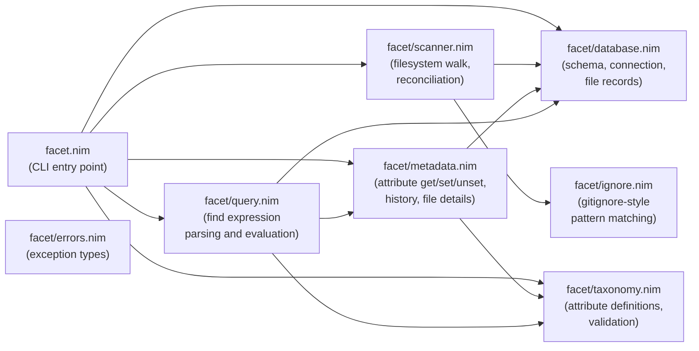
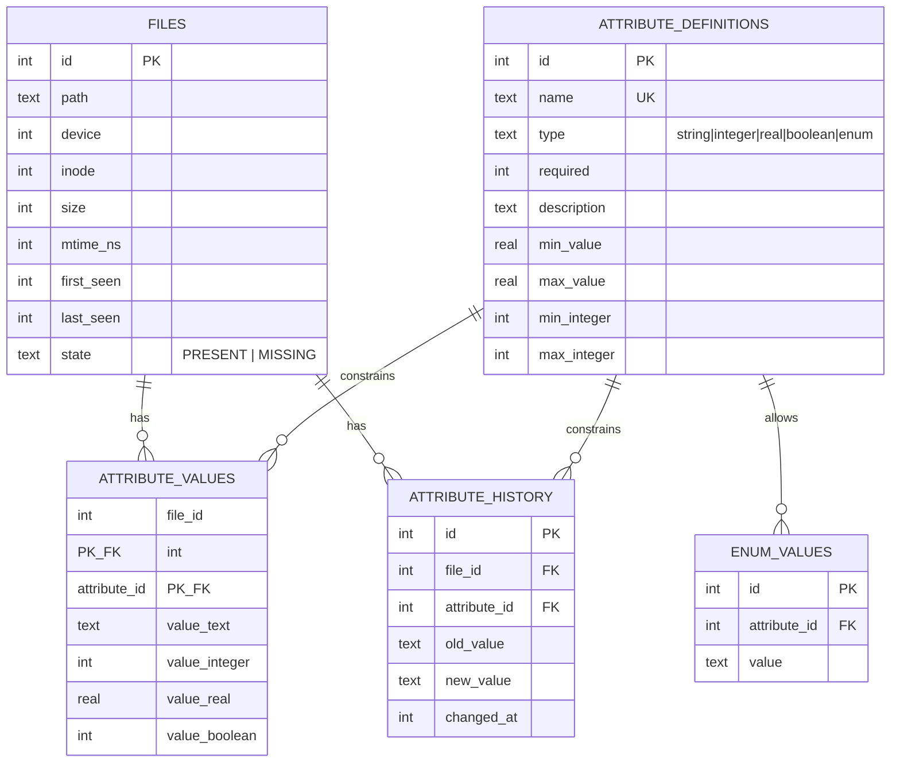
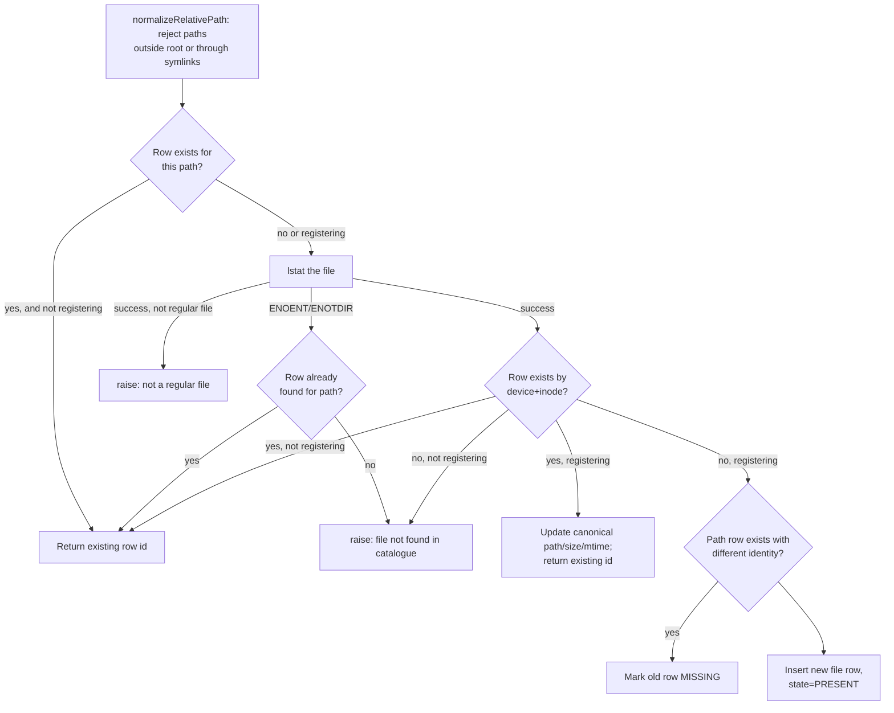
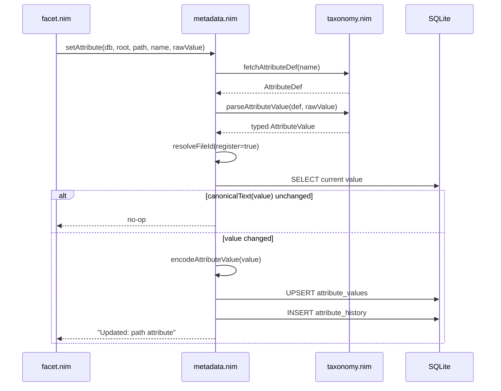

# Facet Design

This document describes the internal architecture of Facet: module
responsibilities, the catalogue schema, and the control flow of its main
operations.

## Goals and Non-Goals

Facet catalogues Linux regular files under a root directory and lets users
attach typed, schema-validated metadata ("attributes") to them, tracking
attribute changes over time. It identifies files by `(device, inode)` so that
renames and moves don't lose associated metadata.

Non-goals: cross-filesystem identity, non-regular files (directories, symlinks,
devices), and distributed/multi-writer catalogues.

## Module Overview



- **`facet.nim`**: parses `commandLineParams()`, dispatches to one handler per
  subcommand, and formats output (including colorized `--help` text). All
  `CatchableError`s raised deeper in the stack are caught here, printed as
  `Error: <msg>`, and turned into exit code 1.
- **`database.nim`**: owns the SQLite connection lifecycle, schema
  creation/migration, and low-level CRUD for the `files` table. Also owns root
  detection (`detectRoot`) and path normalization/containment checks
  (`normalizeRelativePath`).
- **`scanner.nim`**: walks the filesystem under a root, applying ignore rules,
  and reconciles the walk results against the catalogue inside a single
  transaction.
- **`ignore.nim`**: standalone gitignore-style pattern parser and matcher used
  by the scanner. No database dependency.
- **`taxonomy.nim`**: CRUD for attribute _definitions_ (name, type, min/max,
  enum values) and value validation/normalization per type.
- **`metadata.nim`**: attribute _values_ on files — resolving/registering a
  file's identity, setting/unsetting values (with history), and rendering file
  details (text or JSON).
- **`query.nim`**: tokenizes and evaluates `facet find` expressions against
  attribute values.
- **`errors.nim`**: a small exception hierarchy (`FilemetaError` and
  `ValidationError`/`NotFoundError`/`UsageError` subtypes) for future structured
  error handling; current command handlers mostly raise plain `ValueError`.

## Data Model

The catalogue is a single SQLite database at `<root>/.facet/catalogue.db`, using
WAL journaling and `PRAGMA foreign_keys = ON`.



Notes:

- `files` has a `UNIQUE(device, inode)` constraint — one row per physical file —
  and a partial unique index `idx_files_present_path` enforcing at most one
  `PRESENT` row per path at a time. `MISSING` rows for the same path can coexist
  historically.
- `attribute_values` stores one typed column per possible value kind; exactly
  one is populated per row, selected by the corresponding
  `attribute_definitions.type`.
- `attribute_history` retains every change, including unset (`new_value` `NULL`)
  and initial-set (`old_value` `NULL`) events, distinguishing SQL `NULL` from an
  empty string.
- Schema version is tracked via `PRAGMA user_version`. Version 1 predates the
  partial-unique `idx_files_present_path` index; `initDatabase` migrates version
  1 to version 2 by rebuilding the `files` table (retaining `hash_algorithm`,
  `hash_value`, and `hash_time`), preserving indexes/triggers, and validating
  foreign keys post-migration. Version 2 predates exact integer bounds;
  `initDatabase` migrates version 2 to version 3 by adding nullable
  `min_integer`/`max_integer` columns to `attribute_definitions`, again
  validating foreign keys before committing. Both migration steps run in
  sequence for a version-1 catalogue. Existing `min_value`/`max_value` (REAL)
  bounds are never rewritten by this migration: `integer` attributes created
  before version 3 keep their REAL bounds and are compared against exactly via
  `compareIntegerToReal`, which never rounds the stored integer value to float.
  New `integer` attributes store bounds in the exact `min_integer`/`max_integer`
  columns instead.

## File Identity Resolution

`resolveFileId` (in `metadata.nim`) is the shared path used by `get`, `set`,
`unset`, and `history` to map a `PATH` argument to a `files.id`:



`register = false` (used by `get`/`history`/`unset`) never creates a row;
`register = true` (used by `set`) will insert or update as needed so a value can
be attached before the next `scan`.

## Scan Reconciliation

`scanRepository` walks the tree (`collectTrackedFiles`, applying ignore rules
from `ignore.nim`; `iterTrackedFiles` remains as a compatibility wrapper), then
performs reconciliation in one transaction:

1. Snapshot every on-disk regular file's `(device, inode)`, path, size, and
   mtime.
2. Mark all currently `PRESENT` rows `MISSING` up front.
3. For each snapshot signature:
   - If known by `(device, inode)`: update path/size/mtime and mark `PRESENT`
     again; classify as moved, updated, or unchanged.
   - Otherwise: insert a new row (`added`).
4. Any row that was `PRESENT` before the scan and not matched this pass stays
   `MISSING` (`missing`).

`collectTrackedFiles` materializes and sorts the whole tree before
reconciliation begins — the diff against the catalogue needs the complete
snapshot, so results cannot be streamed into database mutations one path at a
time.

See the sequence diagram in the
[User Guide](user-guide.md#scanning-and-ignore-rules) for the ignore-matching
flow applied while walking.

## Structured File Identity and Row Decoding

`database.nim` represents a file's physical identity and lifecycle state as
distinct types instead of ad hoc string concatenation:

```nim
type
  FileIdentity* = tuple[device, inode: uint64]
  FileState* = enum
    fsPresent, fsMissing

func identity*(record: FileRecord): FileIdentity =
  (device: record.device, inode: record.inode)
```

`FileRecord.state` is a `FileState`, with `parseFileState`/`stateText`
converting to/from the persisted `PRESENT`/`MISSING` strings. `listFiles`,
`queryFileByPath`, and `queryFileBySignature` all share one private
`decodeFileRecord(row)` for the common file-row SELECT layout, so identity and
state decoding happen in exactly one place. `scanRepository` keys its in-memory
snapshot and lookup tables by `FileIdentity` tuples rather than
string-concatenated `"$device:$inode"` signatures.

## Typed Attribute Values

`taxonomy.nim` represents a validated attribute value as `AttributeValue`, a
variant object keyed by `AttributeKind` (`akString`, `akInteger`, `akReal`,
`akBoolean`, `akEnum`), rather than as a loosely-typed string:

```nim
type
  AttributeValue* = object
    case kind*: AttributeKind
    of akString, akEnum: text*: string
    of akInteger: integer*: int64
    of akReal: real*: float64
    of akBoolean: boolean*: bool
```

- `parseAttributeValue(def, raw)` parses and bound-checks a raw CLI string once,
  returning a typed `AttributeValue` (or raising `ValueError` on malformed
  input, out-of-range numbers, non-finite reals, or disallowed enum values).
- `canonicalText(value)` renders a typed value back to its canonical string form
  (e.g. `"03"` normalizes to `"3"`, `"YES"` normalizes to `"true"`), used for
  audit no-op comparison and for display.
- `validateAttributeValue(def, raw)` remains as a thin wrapper —
  `parseAttributeValue` followed by `canonicalText` — for call sites that only
  need the normalized string.

`metadata.nim` bridges typed values and the four-column `attribute_values` table
(`value_text`, `value_integer`, `value_real`, `value_boolean`) with two codec
procs shared by every read and write path:

```nim
type AttributeColumns* = tuple[text, integer, real, boolean: DbValue]

proc encodeAttributeValue*(value: AttributeValue): AttributeColumns
proc decodeAttributeValue*(kind: AttributeKind,
    columns: AttributeColumns): Option[AttributeValue]
```

`encodeAttributeValue` populates only the column matching `value.kind`, leaving
the rest SQL `NULL`. `decodeAttributeValue` is the exact inverse, returning
`none(AttributeValue)` when the active column is `NULL` (e.g. a legacy row
predating a column). `decodeAttributeRow` and `fileAttributes` both call
`decodeAttributeValue` and render with `canonicalText`, so there is a single
decode implementation instead of duplicated per-kind case statements.

## Attribute Write Path

`setAttribute` and `unsetAttribute` (in `metadata.nim`) both run inside a single
`db.transaction`, ensuring the attribute value change and its history entry are
atomic:



## Query Evaluation

`facet find` tokenizes the expression (respecting double-quoted string literals
with JSON-style escapes) and parses it into typed `QueryClause` objects
left-to-right:

```nim
type
  QueryOperator* = enum
    qoEqual, qoNotEqual, qoLess, qoLessEqual, qoGreater, qoGreaterEqual
  QueryLogic* = enum
    qlEnd, qlAnd, qlOr
  QueryClause* = object
    attribute*: string
    operator*: QueryOperator
    expected*: string
    nextLogic*: QueryLogic
```

`parseQueryClauses` converts operator/logic tokens to these enums once, up
front; `parseQuery` remains as a `(attr, op, value, logic)` string-tuple adapter
over it for any compatibility callers. Clauses are then evaluated against every
catalogued file: consecutive `AND` clauses form a group that must all match, and
each `OR` starts a new group; a file matches if any group fully matches.
Ordering operators (`<`, `<=`, `>`, `>=`) first try to parse both operands as
`int64`; if both succeed, comparison is exact. If one operand is an integer and
the other is a decimal/exponent literal, the integer is compared against the
float via `compareIntegerToReal` without rounding it to float first. If neither
operand is an integer, both are parsed as `float64`. Non-finite or unparsable
operands never match. `==`/`!=` remain canonical string comparisons; non-numeric
operands fall back to string equality/inequality only for ordering operators as
well, which never match.

### Attribute Loading Strategy

`findFilesForExpression` loads data in exactly two `SELECT`s per query,
regardless of file or clause count:

1. `SELECT id, path FROM files ORDER BY path` — every catalogued file.
2. One join across `attribute_values`/`attribute_definitions`, consumed via
   `db.iterate` (not `db.all`, to avoid materializing every row twice), that
   decodes each row with the Task 6 typed-value codecs
   (`decodeAttributeValue`/`canonicalText`) and retains only the attribute names
   referenced by the parsed clauses, keyed by
   `fileId -> attrName -> canonicalText`.

Both reads run inside one transaction for a consistent snapshot. Clause
evaluation then proceeds entirely in Nim against the in-memory table — neither
the per-file loop nor the per-clause loop issues further SQL. This replaces the
previous per-file/per-clause query pattern (one `SELECT` per file per clause).

**Tradeoff**: the join still visits every stored `attribute_values` row once per
query, even when only a few attributes are requested — filtering by requested
name happens in Nim, not SQL, to keep the query portable and avoid SQLite's
placeholder-count limits when many attributes are named. This is a memory/read
tradeoff, not a universal speedup guarantee: on a disposable 1,000-file,
3-attribute, 4-clause fixture, matching-result output was byte-identical before
and after, and wall-clock time dropped from ~0.040s to ~0.013s in one
measurement on the author's machine — informal observations, not a benchmark
suite or pass/fail threshold.

## Error Handling

Lower layers raise built-in exceptions (chiefly `ValueError`) or the
`errors.nim` hierarchy on invalid input, missing catalogues, or constraint
violations. `main()` in `facet.nim` is the single catch point: any
`CatchableError` is reported as `Error: <message>` on stderr with exit code 1,
keeping error formatting centralized and command handlers free of try/except
boilerplate.

## Testing Strategy

The regression suite (`tests/test_facet.nim`) drives the built `facet` binary
against disposable temporary roots — it never touches the workspace's own
`.facet` catalogue. This validates the CLI end-to-end (argument parsing,
catalogue creation, scanning, attribute mutation, queries) rather than
unit-testing modules in isolation.
