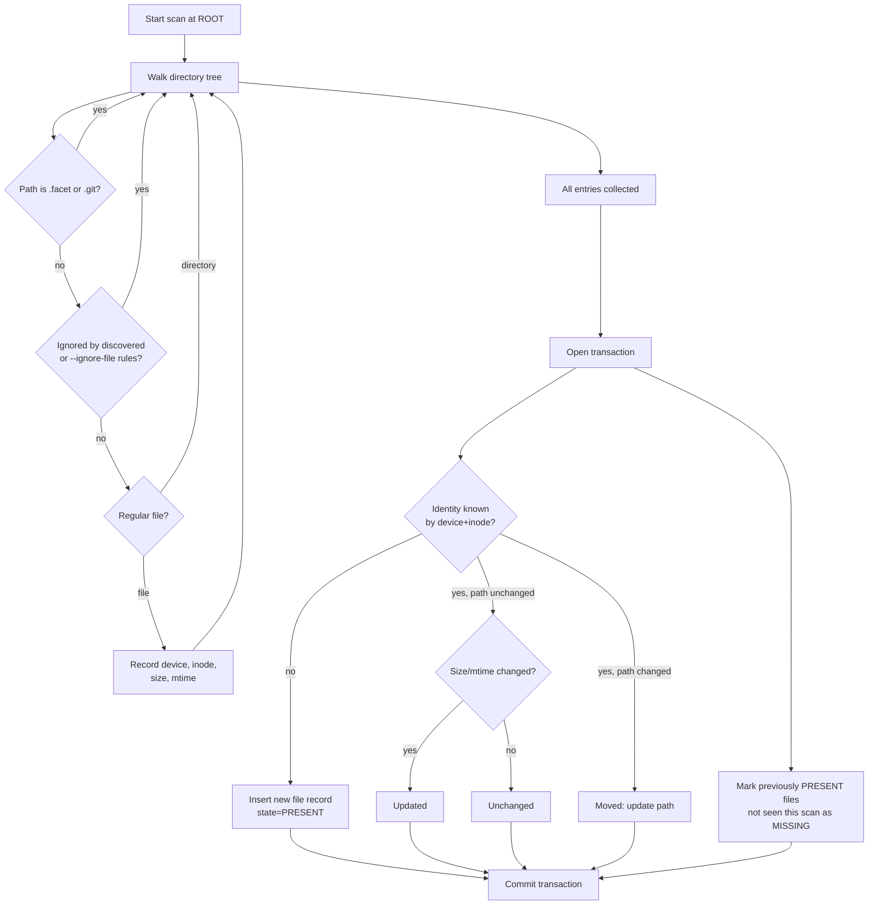

# Facet User Guide

Facet is a CLI that catalogues Linux regular files and typed, user-defined
metadata ("attributes") in a per-root SQLite database at
`<root>/.facet/catalogue.db`. It tracks files by device/inode identity, survives
renames, records attribute change history, and supports simple query expressions
for filtering files.

## Installation and Build

Facet is a Nim project built via Make targets that invoke the project's Nix
development shell.

```sh
make build            # compile to dist/facet
make release          # compile an optimized release binary
make test             # build and run the regression suite
make test-existing    # run tests without rebuilding (validates dist binary)
```

## Core Concepts

- **Root**: a directory whose `.facet/catalogue.db` holds the catalogue for
  every file beneath it.
- **Catalogue**: an SQLite database recording tracked files, taxonomy (attribute
  definitions), attribute values, and attribute history.
- **File identity**: each tracked file is identified by its `(device, inode)`
  pair, not by path. Renames and moves within the same root preserve the record,
  its attributes, and its history.
- **State**: a tracked file is either `PRESENT` (found on the most recent scan)
  or `MISSING` (previously tracked, no longer found).
- **Taxonomy**: user-defined attribute schemas (`string`, `integer`, `real`,
  `boolean`, `enum`) that constrain what values can be set on files.

### Root Resolution

If a command is given an explicit `ROOT` argument, that directory is used
directly. Otherwise, Facet searches upward from the current directory for a
`.facet/catalogue.db`, matching the nearest ancestor (similar to how `git`
locates a repository).

## Commands

| Command                                                                      | Description                                                              |
| ---------------------------------------------------------------------------- | ------------------------------------------------------------------------ |
| `facet init [ROOT]`                                                          | Initialise a catalogue under `ROOT` (defaults to the current directory). |
| `facet scan [--no-ignore] [--ignore-file PATH]... [--verbose-ignore] [ROOT]` | Walk the filesystem and reconcile the catalogue with what's on disk.     |
| `facet status [ROOT]`                                                        | Show the resolved root and count of tracked files.                       |
| `facet list [ROOT]`                                                          | List all tracked paths.                                                  |
| `facet get PATH [--json] [ROOT]`                                             | Show a file's state, size, modified time, and attributes.                |
| `facet set PATH ATTRIBUTE VALUE [ROOT]`                                      | Set (and validate) an attribute value on a file.                         |
| `facet unset PATH ATTRIBUTE [ROOT]`                                          | Remove an attribute value from a file.                                   |
| `facet history PATH [ATTRIBUTE] [ROOT]`                                      | Show the attribute change history for a file.                            |
| `facet find 'EXPRESSION' [ROOT]`                                             | List paths of files matching a query expression.                         |
| `facet taxonomy add NAME TYPE [VALUES...] [--min N --max N] [ROOT]`          | Define a new attribute.                                                  |
| `facet taxonomy list [ROOT]`                                                 | List defined attributes.                                                 |
| `facet taxonomy show NAME [ROOT]`                                            | Show one attribute's definition.                                         |
| `facet taxonomy remove NAME [ROOT]`                                          | Delete an attribute definition.                                          |

Only `init` and `scan` create a catalogue; every other command requires one to
already exist. `get`, `history`, and `unset` never register new files; `set` can
register an in-root regular file before the next scan sees it.

### Examples

```sh
facet init /data
facet scan /data
facet taxonomy add note string /data
facet set docs/a.txt note 'hello world' /data
facet get docs/a.txt --json /data
facet find "note == \"hello world\"" /data
```

## Scanning and Ignore Rules

`facet scan` walks the root directory tree, computing file identity
(device/inode), size, and modification time for every regular file, then
reconciles the result with the catalogue in a single transaction:

- New files are **added**.
- Files whose identity is already tracked but whose path or metadata changed are
  **updated** (or **moved** if only the path differs).
- Previously `PRESENT` files not seen in this scan become **missing**.
- Unchanged files are counted but not written.

By default, scanning honors gitignore-style rules discovered per directory from
`.gitignore` and `.facetignore` files, same as `git` would. `.facet` and `.git`
directories are always skipped regardless of ignore flags.

- `--no-ignore` disables per-directory `.gitignore`/`.facetignore` discovery.
- `--ignore-file PATH` adds an explicit, repo-wide ignore file whose rules take
  highest precedence (evaluated after all per-directory rules).
- `--verbose-ignore` prints each ignored path and which rule/source matched it.
- Precedence follows git semantics: the **last matching rule wins**, and a
  `!`-prefixed rule negates (un-ignores) a previous match.



## Attributes and Taxonomy

Before a file can carry a custom attribute, the attribute must be defined with
`facet taxonomy add`:

```sh
facet taxonomy add rating integer --min 1 --max 5
facet taxonomy add status enum draft reviewed published
facet taxonomy add note string
```

Supported types: `string`, `integer`, `real`, `boolean`, `enum`.

- `integer`/`real` accept `--min`/`--max` bounds; each flag requires a value,
  and `--min` must not exceed `--max`. `integer` bounds must parse as exact
  64-bit integers (no fractional or exponent form).
- `real` values and bounds must be finite: `nan`, `inf`, and `-inf` (in any
  case) are rejected, and never stored.
- `enum` requires a fixed list of allowed values with no duplicates. Failed or
  duplicate enum definitions do not partially create the attribute.
- `boolean` accepts `true`/`false`/`1`/`0`/`yes`/`no`/`on`/`off` (case
  insensitive), normalised to `true`/`false`.

`facet set` validates the raw value against the attribute's definition,
registers the file if needed, and records the change:

- If the new (validated) value equals the current value, nothing is written.
- Otherwise the value is upserted and an `attribute_history` row is inserted
  recording the old and new value, in the same transaction.

`facet unset` removes the current value and records a history entry with a
`NULL` new value (distinct from an empty string).

## Querying

`facet find` accepts a small expression language over defined attributes:

```text
ATTRIBUTE OP VALUE [AND|OR ATTRIBUTE OP VALUE]...
```

- Operators: `==`, `!=`, `<`, `<=`, `>`, `>=`.
- `VALUE` may be a bare token or a double-quoted string (supporting JSON-style
  escapes).
- Numeric comparison operators (`<`, `<=`, `>`, `>=`) compare values as floating
  point; `==`/`!=` fall back to string comparison if the values aren't numeric.
- Clauses combine left-to-right: consecutive `AND`-joined clauses form a group
  that must all match; an `OR` starts evaluating a new group, and a file matches
  if any group fully matches.

```sh
facet find 'rating >= 4'
facet find 'status == "published" AND rating >= 4'
facet find 'status == "draft" OR status == "reviewed"'
```

## History

`facet history PATH [ATTRIBUTE] [ROOT]` prints every recorded change for a file,
most recent first, optionally filtered to one attribute:

```sh
facet history docs/a.txt
facet history docs/a.txt note
```

Each line shows `ATTRIBUTE: OLD -> NEW @ TIMESTAMP` (timestamps are Unix
nanoseconds).

## File Identity, Renames, and Hard Links

- A `(device, inode)` pair identifies one record. Renaming or moving a file
  within the root preserves its ID, attributes, and history — the next
  `facet scan` picks up the new path.
- Replacing a path with a file of a different identity does **not** inherit the
  old record's metadata; the old record becomes `MISSING` unless it's found at
  another path in the same scan.
- Hard links share one record. Facet retains whichever path is currently
  canonical (the previously recorded path if that link still exists, otherwise
  the lexicographically first in-root path).
- Path lookups prefer `PRESENT` records, then the `MISSING` record with the
  greatest `last_seen`, breaking ties by greatest ID.
- Paths outside the catalogue root and paths passing through symlinks are
  rejected.

## Output and Environment

- `--json` on `facet get` prints a JSON object instead of plain text.
- Colored help output can be disabled with `NO_COLOR=1` or `FACET_COLOR=0`.

## Errors

Commands validate their arguments and catalogue state up front; failures are
printed to stderr as `Error: <message>` and the process exits with a non-zero
status.
